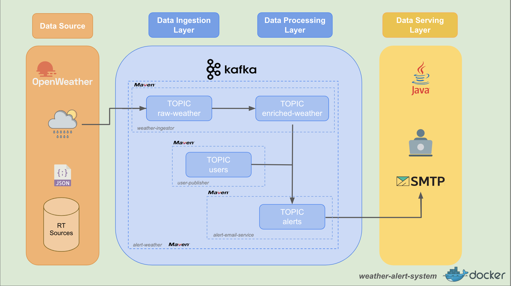

# 🌦️ Weather Alert System


Sistema de alertas meteorológicas construido con microservicios en Java y Kafka. Consulta la
API OpenWeather y procesa los datos para envíar alertas de lluvia por correo electrónico a los
usuarios registrados.

## 🏛️ Arquitectura



### Data Sources

- **OpenWeather API**. Proporciona los datos meteorológicos.
- **cities.json**. Lista de ciudades a monitorizar.
- **users.json**. Usuarios registrados con su zona y umbral de precipitación.

### Ingestion Layer

- **weather-ingestor**. Consulta periódicamente la API OpenWeather para cada
  ciudad y publica los eventos en los topic `raw-weather` y `enriched-weather` de Kafka.
- **user-publisher**. Lee `users.json` y publica los usuario en el
  topic `users` de Kafka.

### Processing Layer

- **alert-weather**. Consume los topic `enriched-weather` y `users` para cada
  evento meteorológico busca los usuarios de la zona y publica una alerta en el topic
  `alerts` si la precipitación supera su umbral.

### Serving Layer

- **email-alert-service**. Escucha el topic `alerts` y envía un correo a cada
  usuario con un mensaje de alerta mediante SMTP.

### Modelo de Datos

- **User**: `name`, `id`, `mail`, `zone`, `threshold`.
- **City**: `name`, `lat`, `lon`.
- **WeatherRaw**: datos completos de la API OpenWeather.
- **WeatherEnriched**: `id`, `location`, `precipitation`, `timestamp`, `timezone`.
- **Alert**: `name`, `mail`, `zone`, `precipitation`, `threshold`, `timestamp`.

## ⚙️ Instalación y Ejecución

1. **Compilar**
   ```bash
   mvn clean package
   ```
2. **Iniciar Kafka**
   ```bash
   docker-compose up -d
   ```
3. **Configurar propiedades**
   - Copia `api.properties.example` a `api.properties` y añada su clave de
     OpenWeatherMap.
   - Copia `smtp.properties.example` a `smtp.properties` con las credenciales de
     su servidor SMTP.
4. **Ejecutar servicios**
   En terminales separados:
   ```bash
   # 1. Levantar servicio de emails
   java -cp email-alert-service/target/email-alert-service-1.0-SNAPSHOT.jar com.comillas.email.AlertEmailService

   # 2. Levantar servicio de alertas
   java -cp alert-weather/target/alert-weather-1.0-SNAPSHOT.jar com.comillas.alert.AlertWeather

   # 3. Publicar usuarios
   java -cp user-publisher/target/user-publisher-1.0-SNAPSHOT.jar com.comillas.user.UserPublisher

   # 4. Lazar el ingestador
   java -cp weather-ingestor/target/weather-ingestor-1.0-SNAPSHOT.jar com.comillas.ingestor.WeatherApp
   
---

## 📁 Estructura del Proyecto

```
weather-alert-system-main/
│
├── alert-weather/               # Generación de alertas
│   └── src/
│       └── main/java/com/comillas/alert/AlertWeather.java
│
├── common/                      # Modelos y utilidades comunes
│   ├── model/
│   ├── utils/ConfigLoader.java
│   └── resources/log4j.properties
│
├── email-alert-service/        # Envío de alertas por correo electrónico
│   └── src/main/java/com/comillas/email/AlertEmailService.java
│
├── user-publisher/             # Publicador de información de usuarios
│   └── src/main/java/com/comillas/user/UserPublisher.java
│
├── weather-ingestor/           # Ingesta de datos meteorológicos desde API
│   └── src/main/java/com/comillas/ingestor/WeatherApp.java
│
├── docker-compose.yml          # Orquestación de servicios
└── pom.xml                     # Proyecto Maven raíz
```

## 📬 Contacto

alertweathersystem@gmail.com
